# Jenkins Demo Setup

## Pre-requisities:

1. Installed 
2. Authenticated azcli
3. Set the subscription to the targeted subscription for deployment with azcli
    * `az account set --subscription <mysubscription>`

## Process

1. Check that you have an ssh public key `cat ~/.ssh/id_rsa.pub` 
    * If there is no file then run `ssh-keygen` to generate one 
2. (optional) Run `curl ifconfig.me` and record your ip 
3. (optional) Overwrite the `may_ip` variable in `demo.tfvars` 
4. Run `terraform init` 
5. Run `terraform apply -var-file ./demo.tfvars --auto-approve` 
6. Record the public ip frm the output 
    * If there is no output then run `terraform apply -var-file ./demo.tfvars --auto-approve` 
    NOTE: THIS SEEMS TO BE REQUIRED CURRENTLY 
7. Log into the instance wit `ssh azureuser@<public_ip_address_here>` 
8. run `sudo tail -f /var/log/cloud-init-output.log` 
9. Stretch 
10. Once the log finishes record the GUID for the Jenkins admin initial password 
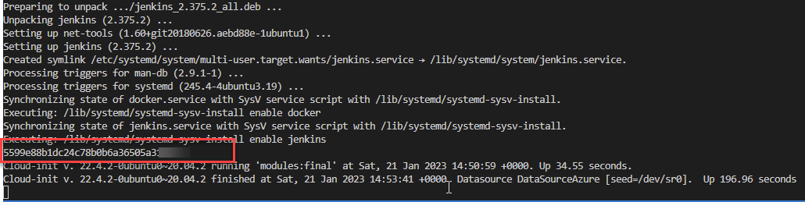 
11. Go to `http://<public_ip_address_here>:8080` 
12. Unlock Jenkins with GUID 
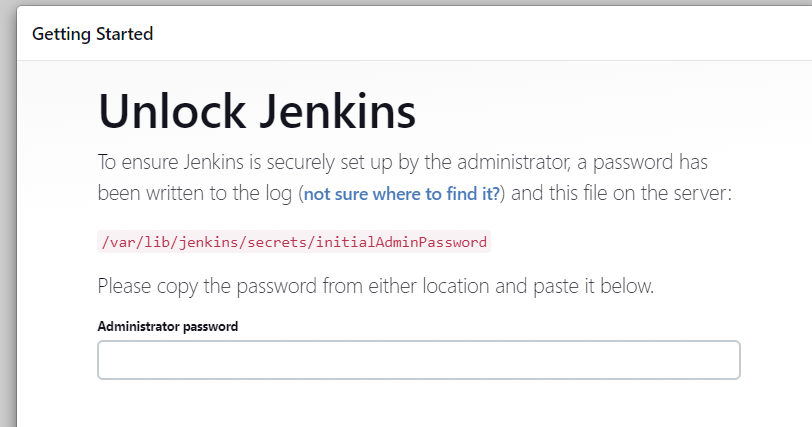 
13. Install suggested plugins 
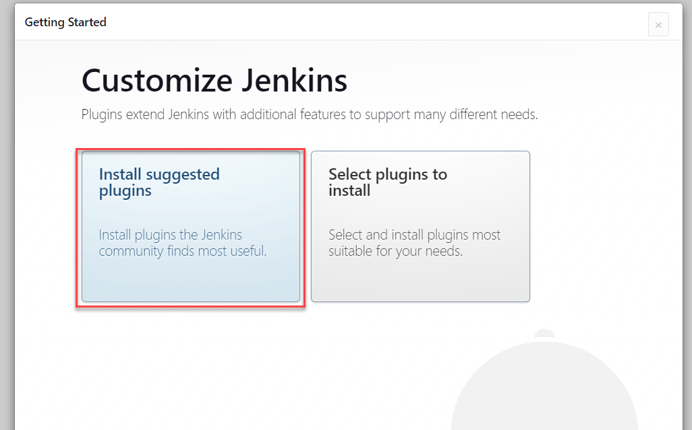 
14. Get coffee 
15. Skip user creation and continue as admin 
16. Select `Not now` for instance configuration 
17. Start using Jenkins 
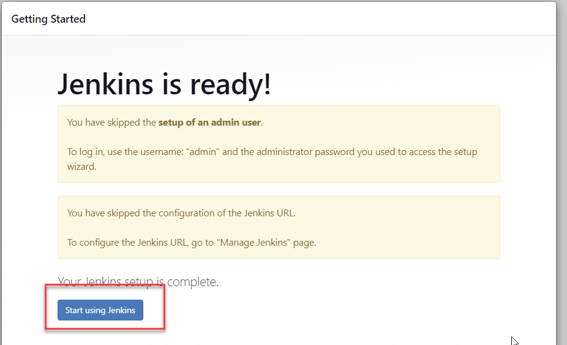 
18. Restart jenkins from the instance `sudo systemctl restart jenkins` 
19. Log back into Jenkins with admin and the initial password
20. Add the credentials to Jenkins 
    a. Manage Jenkins 
    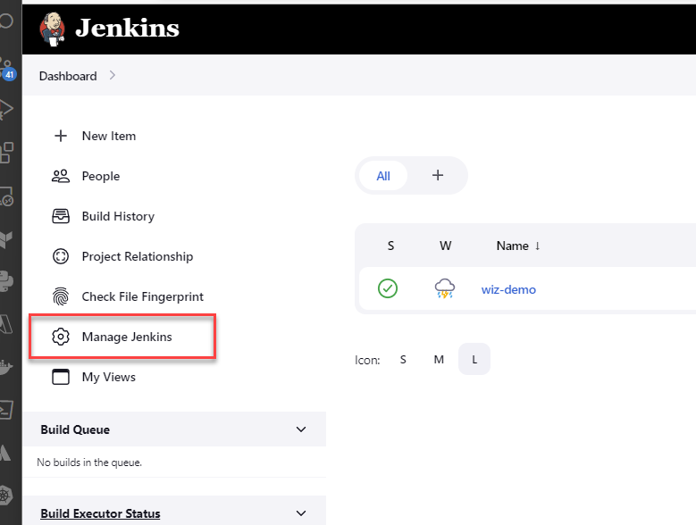 
    b. Manage Credentials 
    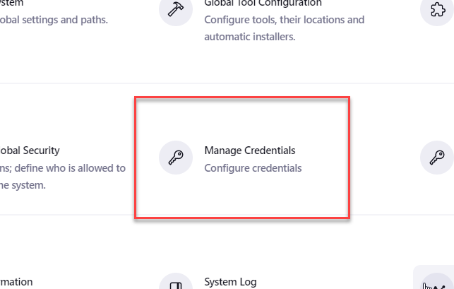 
    c. System 
    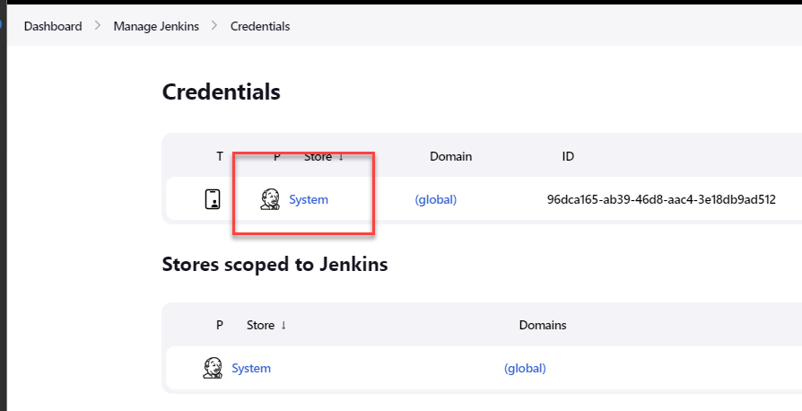 
    d. Global Credentials 
    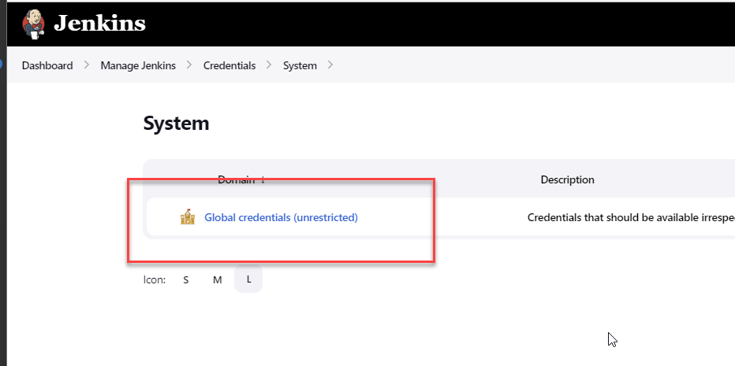 
    e. Add Credentials 
    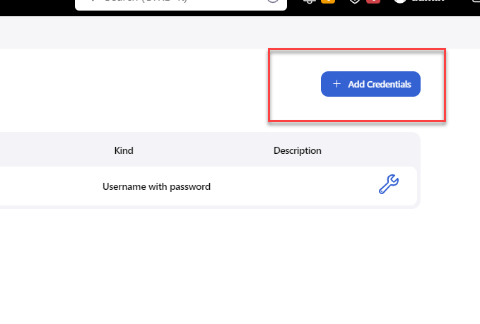
21. Go back to the Jenkins Dashboard 
22. New Item 
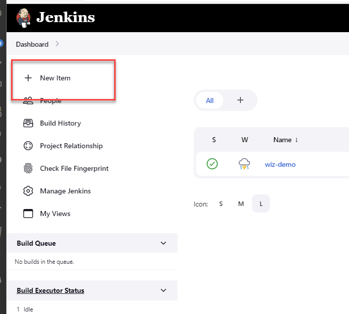 
23. Add pipeline project with name `wiz-demo-pipeline` 
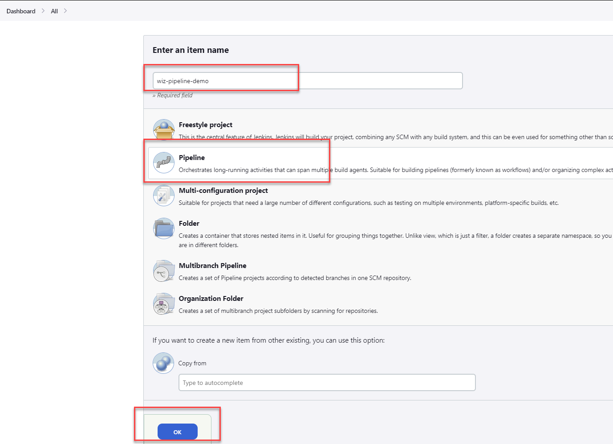 
24. Add the pipeline file data  to the pipeline steps 
25. Run the pipeline 
26. Review output 
27. Add Wiz CICD Policies to the pipeline scans to make the pipeline fail for vulns.. then iac 
